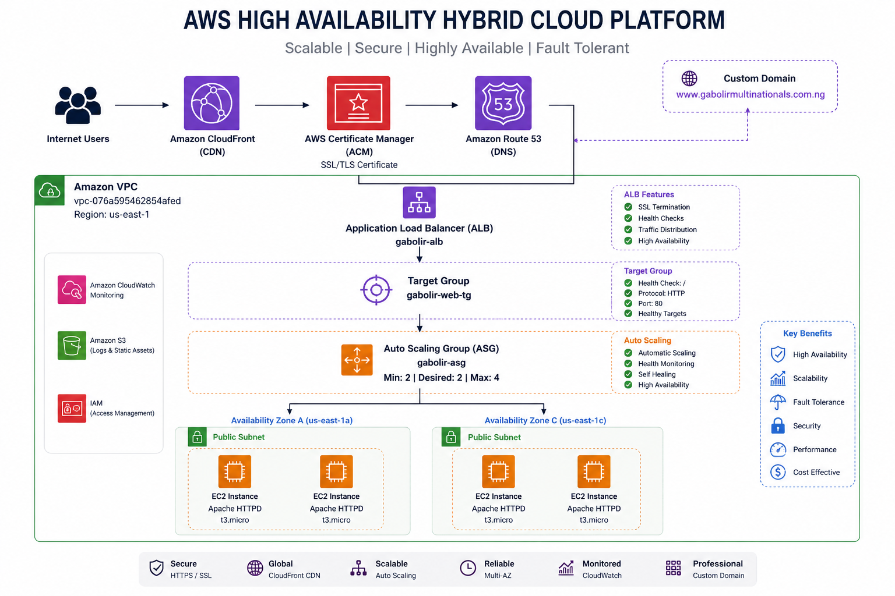
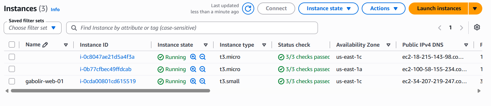
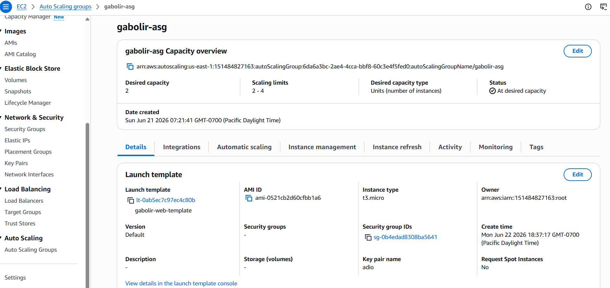
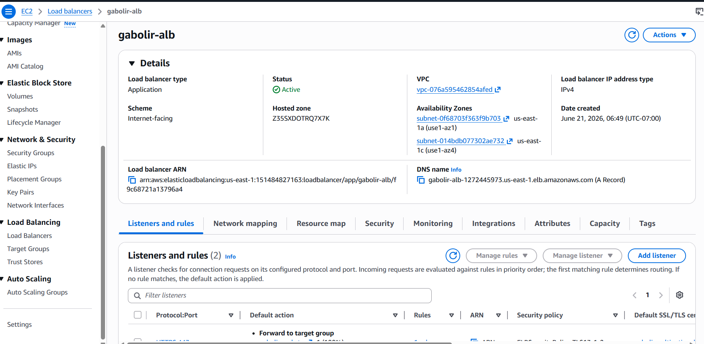
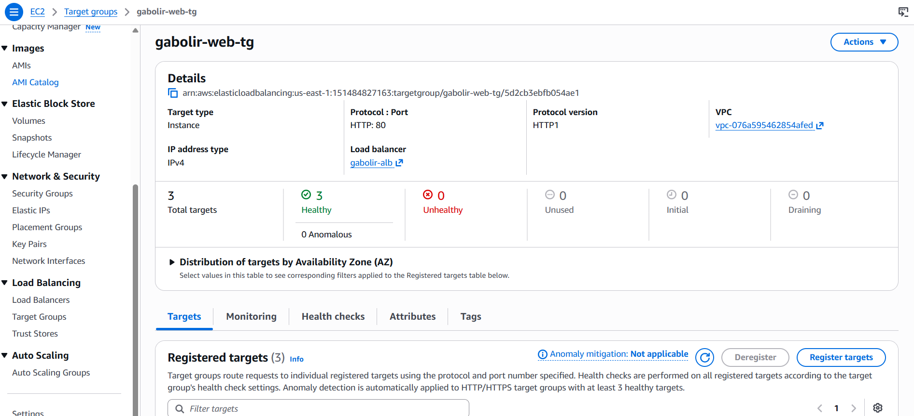
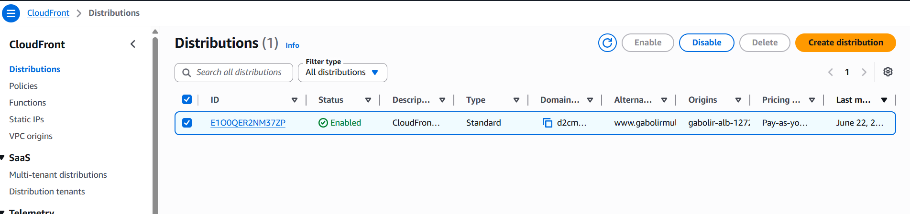
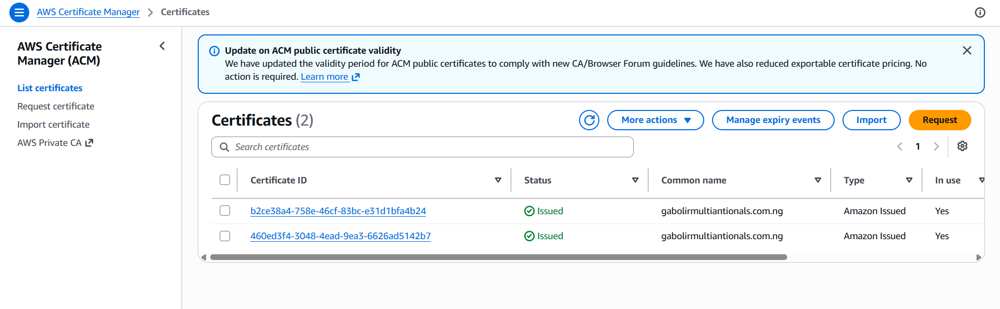
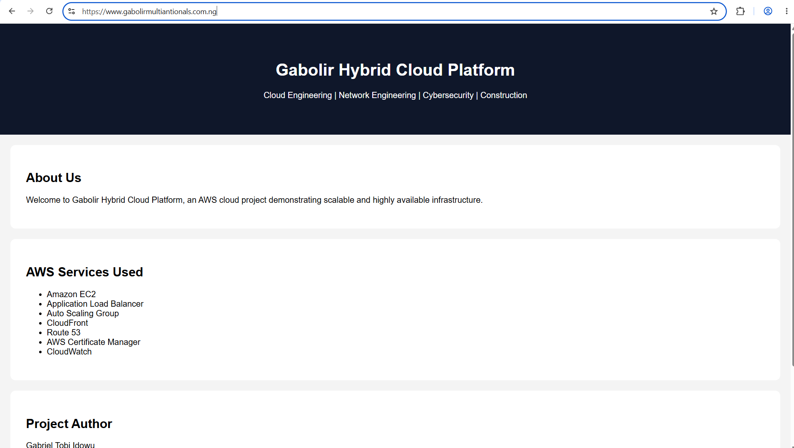
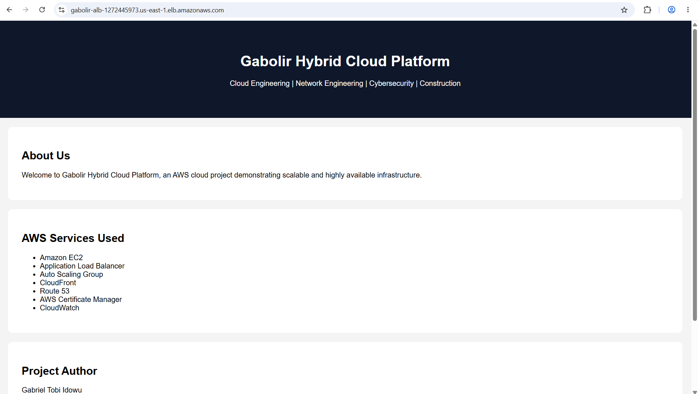

# AWS High Availability Hybrid Cloud Platform



## Project Overview

This project demonstrates the design and implementation of a highly available, scalable, and fault-tolerant web platform on Amazon Web Services (AWS).

The solution leverages Amazon EC2, Application Load Balancer (ALB), Auto Scaling Groups (ASG), Amazon Route 53, AWS Certificate Manager (ACM), Amazon CloudFront, and Amazon CloudWatch to provide a secure and resilient infrastructure capable of handling traffic efficiently while maintaining high availability.

The platform was tested by validating load balancing, health checks, HTTPS connectivity, custom domain integration, and Auto Scaling functionality.

---

## Architecture Diagram

Detailed architecture documentation can be found here:

`architecture/aws-architecture.md`

### Architecture Components

* Amazon Route 53
* AWS Certificate Manager (ACM)
* Amazon CloudFront
* Application Load Balancer (ALB)
* Target Group
* Auto Scaling Group (ASG)
* Amazon EC2
* Amazon VPC
* Multi-AZ Deployment
* Amazon CloudWatch

---

## AWS Services Used

| Service                   | Purpose                        |
| ------------------------- | ------------------------------ |
| Amazon EC2                | Web Server Hosting             |
| Auto Scaling Group        | Automatic Instance Management  |
| Application Load Balancer | Traffic Distribution           |
| Amazon Route 53           | DNS Management                 |
| AWS Certificate Manager   | SSL/TLS Certificate Management |
| Amazon CloudFront         | Content Delivery Network       |
| Amazon CloudWatch         | Monitoring                     |
| Amazon VPC                | Network Isolation              |

---

## Infrastructure Details

### Region

`us-east-1 (N. Virginia)`

### VPC

`vpc-076a595462854afed`

### Application Load Balancer

`gabolir-alb`

### Target Group

`gabolir-web-tg`

### Auto Scaling Group

`gabolir-asg`

### Scaling Configuration

```text
Minimum Capacity: 2
Desired Capacity: 2
Maximum Capacity: 4
```

---

## Validation Testing

### Test 1 – Website Accessibility

Validated successful access using:

`https://www.gabolirmultinationals.com.ng`

**Result:** ✅ Successful

---

### Test 2 – SSL Certificate Validation

Validated HTTPS connectivity using:

* AWS Certificate Manager (ACM)
* Custom Domain
* CloudFront Distribution

**Result:** ✅ Successful

---

### Test 3 – Load Balancer Health Check

Verified healthy targets behind the Application Load Balancer.

**Result:** ✅ 3 Healthy Targets

---

### Test 4 – Auto Scaling Validation

Validated Auto Scaling Group operation with:

```text
Minimum: 2
Desired: 2
Maximum: 4
```

**Result:** ✅ Successful

---
## Project Screenshots

### EC2 Instances



### Auto Scaling Group



### Application Load Balancer



### Target Group Health



### CloudFront Distribution



### ACM Certificate



### HTTPS Website Validation



### Website Through ALB



---

## Skills Demonstrated

* AWS Cloud Infrastructure
* Amazon EC2
* Auto Scaling
* Load Balancing
* Route 53 DNS
* AWS Certificate Manager (ACM)
* Amazon CloudFront
* Amazon CloudWatch
* High Availability Architecture
* Infrastructure Documentation
* Cloud Networking

---

## Future Improvements

* Terraform Infrastructure as Code
* CI/CD Pipeline Integration
* Private Subnets
* Bastion Host
* Amazon RDS
* AWS WAF
* Centralized Logging
* Docker Containerization
* Amazon ECS

---

## Author

### Gabriel Tobi Idowu

Cloud & Infrastructure Engineer

**LinkedIn:**
https://www.linkedin.com/in/gabriel-idowu-a1152a2aa

**GitHub:**
https://github.com/gabxon

---

## Project Status

✅ Completed

✅ Operational

✅ HTTPS Enabled

✅ CloudFront Integrated

✅ Auto Scaling Enabled

✅ High Availability Validated
